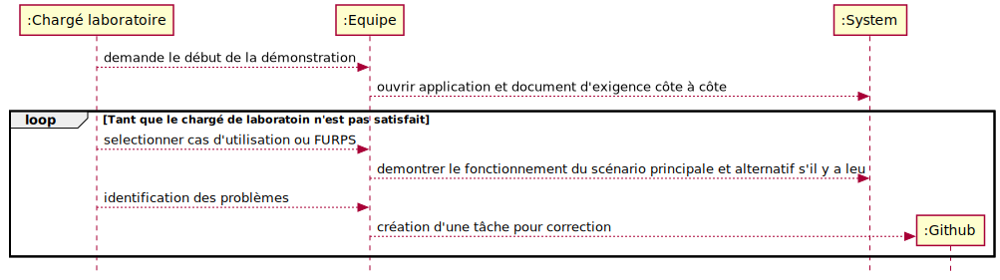
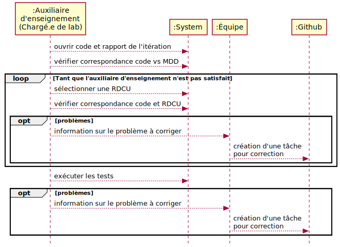

# Système de gestion de l'apprentissage

## Introduction

Le laboratoire consiste à analyser, concevoir, implémenter et tester une solution pour satisfaire les besoins en ce qui concerne une application cliente. [Voir le document des exigences du client](README-exigences-client.md).

## Déploiement du système

Le diagramme suivant décrit les différentes parties du système. Nous cherchons à simplifier les aspects techniques qui ne sont pas le sujet principal du cours: framework d'application frontale, services REST, utilisation de bases de données, etc.
  

Il faut que la solution respecte la séparation des couches présentation et domaine. Les opérations système doivent être le mécanisme pour traverser ces deux couches (pas de logique applicative dans la couche présentation). Pour vérifier cet aspect, la figure suivante est utile:
  
![figure-f16.24-web](https://www.plantuml.com/plantuml/png/dLLjRzem4FuCl-BaIHEje86sczH1efMNlaoiLC3sOHsQJ7A09sDdZaFRJVr1-ntxOpid5AX6gtQHeZZEtVdkUPwxl4yiDpRIjXY9gU7n34xXLx6GBw-yNP1yZ5BgqBSwBcSlFXleYRtc1c5mcrYSG-L-qTBAuerbvGaj59-ZpyvGBj2AaEURYVY9VcqVThrHlLZ0Q8fmzRJnKNxgLgFLbzpIXLGwUaP8I6OyHd-iRsXfRoNw4o4bHcLmpr1BRNnsFHCM6GKj0a0XhCBLilvFLiY4MqmDku-a5roEd1qawJX7BvGfWMA-LGbGM5wRPr6oXImW-C1QEWrd2B7vypj1PRaLMh5wZlvtYkFBEcmfgj8RI_4ZHLPV5rTVdPRLuQA_YgB998eO7PdjrrQbN79Yu1h7NrL9yOMOPbNjhCfIsc9ULe6SAW64-ojNE1iEB-6qCmIFny9RrBm8vzmOD1ymzLf691HcdJDLQ0IQIbFBo86wIhAspeR1-c25csG8jH39QCFfuFbEUSshn1kDuN6psu5chz_kz7rMPN3SFJ-zy5ctSp9aGMFOfxiTD9h1kxvEYSA6rwItlXUKEZUnmIJPQNZEm7EMNXOj21uNaXJJcRrrNNIzmZ87SxEAU_yyQMBgRhkSQe_9wG7TZd2sJM6HddEXyB-rbODv-23l3FnO2sN_GRyCMwXuyw_t4tmNmeCNKpSEtf48szZ6fE6DW_-dAq_uxOiIlii6XbESuvYIjvpCNb80V5xkVZnljxiT1itJLg_R8uSyBp8ywLqCuUIurTd665pspY-6bS7v5_fyn08TlqOUafJh9fiiaD2yVeqah0NMvmYbA8NsO42oTc6NSBbxsoaFezUgp7NAHkkNb9xlP2sp6UqX-3cksPK14mdw3waGIQZxUmVbV9EhAH5KEQoEYaKtVhEEMOyVu76S2gGECP0g65EhqioyvpNYoSpnkbQvMGuTOiH5MaiOzlRse9IW960a1wcd3iIlYa1PTiiE6nNlYkzHHVId_0i0 "figure-f16.24-web")

Notez que la logique du routeur (web) est simple : 
* décortiquer l'argument, p. ex. nom, de la requête et 
* appeler une opération système, p. ex. demarrerJeu(nom), qui est une méthode définie dans une classe (le contrôleur GRASP) dans la couche domaine.

[Cette petite présentation](https://log210-cfuhrman.github.io/log210-valider-architecture-couches/#/) vous donne d'autres astuces pour valider votre solution sur le plan de la séparation des couches.

## Documents de référence

### Squelettes pour commencer le SGA

En plus de ce squelette de démarrage de projet pour Node.js, des exemples de code supplémentaire pour vous aider dans votre projet sont aussi disponibles: : https://github.com/profcfuhrmanets/exemples-ts

> Les solutions impliquant les langages et technologies autres que ceux dans le squelette ne sont pas permises.

Beaucoup de frameworks Web sont faciles à utiliser pour une application simple, mais il n'est pas toujours possible d'appliquer une bonne conception lorsqu'il s'agit d'une application complexe. Pour le respect des aspects importants de la conception (séparation des couches, opérations système avec contrôleur indépendant, possibilité d'avoir des modèles du domaine complexes, etc.), **vous ne pouvez pas utiliser les technologies/solutions suivantes :**
* Framework d'interface utilisateur: Vue.js, React, Angular
* Base de données: SQL et NoSQL

### SGB

Le système de gestion des bordereaux des étudiants (SGB) est un système externe utilisé par votre application pour récupérer les informations sur les enseignants, les cours, les étudiants ainsi que sauvegarder les notes obtenues par les étudiants lors de la réalisation d'un questionnaire ou la correction d'un devoir. **Vous n'avez pas à modifier ce système.**

SGB est une application ayant son propre modèle du domaine (comprenant les concepts comme l'université, les cours, les groupes-cours, les étudiants, les évaluations. Bien que votre application SGA ne traite que l'aspect pédagogique en ligne, votre analyse de SGA doit comprendre les classes conceptuelles de SGB.

<b>Cliquez ici pour voir les détails sur le MDD du SGB</b>

[Fichier source en PlantUML](https://raw.github.com/profcfuhrmanets/log210-jeu-de-des-node-express-ts/master/docs/modeles/mdd_sgb_sga.puml)  

Veuillez noter que l'implémentation proposée de ce système n'a aucun mécanisme de persistance des données. Il possède une interface de configuration permettant de nettoyer le contenu correspondant aux notes ou de modifier la latence de celui-ci.
https://github.com/yvanross/log210-systeme-gestion-bordereau-node-express-ts

L'API de SGB est disponible avec le code source ou à l'adresse suivante: https://cc-yvanross.github.io/8e8addd727f14edfd8c50bd99633c611956f0439/dist/docs/index.html

## Application frontale et persistance minimalistes

Vous devez implémenter une interface utilisateur minimaliste pour la réalisation de chacun des cas d'utilisation. Le but du laboratoire étant d'appliquer la méthodologie d'analyse et de conception enseignée dans LOG210, le squelette à un mécanisme simple pour faire l'application frontale. Il s'agit des templates HTML (pug, etc.) plutôt qu'un framework complexe comme Angular.js, React, Vue, etc. Pour la même raison, les technologies de bases de données ne sont pas proposées pour la solution. Il est possible de réaliser le laboratoire sans passer du temps sur ces aspects que vous verrez plus en profondeur dans d'autres cours spécialisés.

## Déroulement des itérations

Chaque itération nécessite un avancement (évolution) sur le plan des exigences par une valeur minimale indiquée.

- Itération 1 - 3 points
- Itération 2 - 3 points supplémentaires
- Itération 3 - 4 points supplémentaires

Les points associés à chaque exigence sont définis dans la grille de correction.

## Déroulement des corrections interactives

Les corrections interactives à chaque itération seront réalisées en suivant le processus suivant. Les chargés de laboratoire veillent au bon déroulement de la correction, mais ce sont les étudiants qui doivent prendre l'initiative de suivre ces étapes à la lettre.

### Démonstration

L'objectif de cette partie est de montrer le fonctionnement de l'application au client. Elle suit les étapes suivantes :

#### Évaluation de l'implémentation et des tests

L'objectif de cette partie et de montrer que l'application est conforme aux principes vus en classe et à la conception des étudiants. Elle suit les étapes suivantes :

- Vérifier correspondance code et RDCU
    1. une méthode avec le même nom est présente dans un routeur. Elle doit :
        1. commencer par /api/v1
        2. utiliser le verbe REST approprié
        3. extraire et convertir et vérifier la présence des paramètres de la requête HTTP
        4. faire un seul appel à la méthode du contrôleur et retourne sa réponse sous forme de JSON avec le code HTTP approprié
        5. intercepter et traiter les erreurs adéquatement
        6. :warning: [Cette méthode ne doit pas retourner une vue](https://github.com/profcfuhrmanets/log210-jeu-de-des-node-express-ts/wiki/Vue-sans-route-d'API-(endpoint)). Pour ce faire, il faut faire une autre route qui appelle l'opération système.
    1. une méthode avec la même signature est présente dans un contrôleur. 
       1. L'opération du contrôleur ne doit pas utiliser d'objets comme paramètres
       2. Le retour d'opération correspond à une valeur primitive

- exécuter les tests
  1. des tests pour vérifier le scénario principal, les scénarios alternatifs et la gestion des erreurs de l'opération système sont présents. Ils doivent :
        1. être exécutés pour montrer leur fonctionnement
        2. appeler la route appropriée
        3. vérifier son code HTTP
        4. vérifier chacun des champs de la réponse

## Processus d'évaluation des laboratoires

Le travail de laboratoire sera évalué en deux volets, soit la partie **rapport et planification** et la partie **implémentation**.

Voir la grille de correction pour plus de détails.

| Évaluation                 | Itération 1 | Itération 2 | Itération 3 | Total       |
|:---------------------------|:-----------:|:-----------:|:-----------:|:-----------:|
| Rapport et planification   | a           | b           | c           | (a + b + c) |
| Implémentation    | -           | -           | d           | d           |

### Rapport et planification

Les critères d'évaluation de chaque itération (a, b, c) sont documentés dans la section [modalités d'évaluation](#modalités-dévaluation).

### Implémentation

Vous recevrez une rétroaction vers la fin de chaque itération, selon le processus itératif et évolutif. Notez que seulement l'évaluation (d) de la dernière itération comptera pour la note. De cette manière, on peut réduire les conséquences négatives des erreurs de planification et des difficultés avec la maîtrise des nouvelles technologies qui sont normales au début du projet.

Cependant, il peut y avoir une pénalité à la fin d'une itération si les critères de la grille de pointage ne sont pas respectés.

Le calcul de la note pour cette évaluation est le suivant :

Si une équipe ne réussit pas à répondre adéquatement à une exigence (fonctionnalité, tests, correspondance aux artéfacts), cette dernière ne sera pas utilisée dans le calcul.

Pour les valeurs de *d* dépassant 100%, le maximum est 120%.

### Dates de remises

Notez que le calendrier des séances est différent pour chaque groupe-cours, mais les dates de remises suivent cette planification. Le rapport doit être prêt pour la démo afin de montrer la correspondance entre la conception et la solution.

| Itération | Plan d'itération      | Démo / Rapport  |
| --------: | :-------------------- | :-------------- |
|         1 | Fin séance 3 du labo  | Début séance 6  |
|         2 | Fin séance 7 du labo  | Début séance 9  |
|         3 | Fin séance 10 du labo | Début séance 12 |

[Dates des séances de lab](https://calendar.google.com/calendar/embed?height=600&amp;wkst=1&amp;bgcolor=%23ffffff&amp;ctz=America%2FNew_York&amp;src=Y185b3UycWwwcjBjNm1iOHYzMnFsMjR2NmJhZ0Bncm91cC5jYWxlbmRhci5nb29nbGUuY29t&amp;src=Y190ZGh0NG84OW5rNGozY2htYmJkZjBsNWFoZ0Bncm91cC5jYWxlbmRhci5nb29nbGUuY29t&amp;color=%23F4511E&amp;color=%23C0CA33&amp;mode=AGENDA&amp;hl=fr_CA&amp;title=Calendrier%20des%20s%C3%A9ances%20de%20laboratoire%20LOG210%20%C3%89t%C3%A9%202021)

### Correction interactive du [rapport](RAPPORT-iteration-i.md) de l'itération 1

À la deuxième semaine de l'itération 1, vous devrez présenter les artéfacts, l'implémentation et les tests des CU01a et CU01b à votre chargé de laboratoire. Vous recevrez des commentaires pour vous aider avant la remise de votre premier rapport et de votre première démo. Cette activité est informelle, mais votre participation est notée et obligatoire.

## Plan d'itération

Au lieu de faire un plan d'itération sous forme de document texte qui est généralement statique, vous devez utiliser Github issues.

Je vous suggère d'utiliser les Labels pour [classer les issues](https://softwareengineering.stackexchange.com/questions/129714/how-to-manage-github-issues-for-priority-etc).  

Vous trouverez ci-dessous les différents types de tâches que nous nous attendons à retrouver dans votre Github issues.

### Tâches: Étapes jalons

> Dates clés montrant les délais, comme date de début et de fin; étapes intermédiaires; points de synchronisation avec d'autres équipes; démonstrations; et ainsi de suite pour l'itération.

Vous devez utiliser les étapes-jalon (Milestones) suivantes pour regrouper vos tâches:
1. Correction interactive du rapport de l'itération #1
2. Rapport itération #1	
3. Implémentation itération #1
4. Rapport itération #2	
5. Implémentation itération #2 
6. Rapport itération #3	
7. Implémentation itération #3

### Tâches: Objectifs clés (issues)

> Afficher les tâches d'objectifs clés pour l'itération, généralement un à cinq. *(exemples)*  
> **⚠️Faites attention de respecter les points minima d'avancement par itération indiqués dans l'énoncé, sinon vous pouvez avoir une pénalité si vous n'avancez pas assez. Vérifiez avec un chargé de laboratoire avant de commencer l'itération!**
> Assurez-vous d'assigner chaque tâche à un étudiant qui en sera responsable
> Le changement d'état d'une tâche doit nécessairement être justifié par un commentaire.

- CU06 - Présenter une démonstration technique
- CU07 - Faire vidéo pour la démonstration technique avec les tests
- Réviser CU07
    > Le CU06 a été convaincant pour le chargé de laboratoire, mais il a trouvé que les tests pour le CU07 n'étaient pas assez étoffés. On doit corriger ça à la prochaine itération si on veut que le CU07 compte pour l'implémentation finale. Donc une nouvelle tâche pour réviser les CU07 a été créée et assignée.  Je peux retrouver cette tâche dans un comprenant tous les commentaires du chargé de laboratoire.

### Pour planifier vos itérations

- <a onclick="window.open('https://docs.google.com/a/etsmtl.net/document/d/1xeCCdR4-sTznTPaSKYIl4l_bQi-gE5stPWSA5VArRlY/edit?usp=sharing')">Comment planifier une itération selon le processus unifié</a>

- <a onclick="window.open('https://docs.google.com/a/etsmtl.net/document/d/1bDy0chpWQbK9bZ82zdsBweuAgNYni3T2k79xihr6CuU/edit?usp=sharing')">Comment estimer la taille d'une itération</a>

## Modalités d'évaluation

### Grille de pointage de tous les artéfacts

Cette grille d'évaluation présente le pointage associé à chacun des artéfacts que vous avez à remettre pour ce laboratoire.

|Artéfact|Pondération|
|--------|:---------:|
|Plan d'itération 1| 1|
|Correction interactive du rapport 1|2|
|Rapport 1|5|
|Plan d'itération 2|1|
|Rapport 2|6|
|Plan d'itération 3|1|
|Rapport 3|6|
|Implémentation| Réalisation exigences (10) Test (2.5) Qualité du code (2.5) |
| Total | 35%|

### Grille de pointage des exigences

| Exigence |Points|
|----------|:----:|
|CU01-Gérer cours	|1|
|CU02-Gérer questions	|2 contrats|
|support question type choix multiple	|0,5|
|support question type mise en correspondance	|0,5|
|support question type réponse courte	|0,5|
|support question type numérique|	0,5|
|support question type choix essai	|0,5|
|CU03-Corriger devoir	|1|
|CU03 facultatif 5-6-7a	|1|
|CU04-Gérer devoir	|2 contrats|
|CU05-Gérer questionnaire	|2 contrats|
|CU06-Remettre devoir	|1|
|CU07-Passer questionnaires	|2 contrats|
|support question type choix multiple	|0,5|
|support question type mise en correspondance	|0,5|
|support question type réponse courte	|0,5|
|support question type numérique	|0,5|
|support question type choix essai	|0,5|
|F1 - Journalisation et traitement d'erreurs	|1|
|F2 - Sécurité	|1|
|U1 - Facteurs humains	|0.25|
|R1 – Robustesse (CU03)	|2|
|P1 – Performance pour le passage de questionnaire	|2|
|S2 - Contrainte de développement: environnement d'intégration continue	|1|
|S3 - Contrainte de développement: gestion sémantique de version|	1|
|S4 - Contrainte d'implémentation: banque de questions en format GIFT	|2|

**contrats:** Vous devez obligatoirement réaliser les artéfacts de contrat pour cette exigence.

## Grilles de correction

### Critères appliqués au plan d'itération

|Plan d'itération|Pondération|Niveau|
|-----------------------|:---------:|--------|
|Qualité du Plan|3|Pas de problème de qualité (3) Quelques problèmes de qualité (2) Beaucoup de problèmes de qualité (1) Qualité inacceptable (0)|
|Complétude du Plan|3|Toutes les tâches sont présentes (3) Quelques tâches sont manquantes (2) Beaucoup de tâches sont manquantes (1) La planification n'est pas réaliste(0)|

### Critères appliqués au rapport

|Déductions|	Pondération	|Critères|
|----------|:--------------:|--------|
|Mauvaise qualité du français|	-3| Quelques fautes (-1) Beaucoup de fautes (-2) Énormément de fautes (-3)|
|Mauvaise présentation du rapport|	-3| Peu d'erreurs de présentation (-1) Quelques erreurs de présentation OU absence du rapport en PDF (-2) Quelques erreurs de présentation ET absence du rapport en PDF (-3)|
|Pénalité pour refus de correction par le chargé de laboratoire|	-6||

**<u>Pénalité pour refus de correction par le chargé de laboratoire</u>:**
Un travail qui contient trop d'erreurs fréquentes peut être refusé par le chargé de laboratoire. L'équipe peut reprendre le travail avec une pénalité.

### Critères appliqués aux artéfacts d'analyse et de conception du rapport

|MDD|Pondération|Niveau|
|-----------------------|:---------:|--------|
|Qualité du MDD|3|Pas de problème de qualité (3) Quelques problèmes de qualité (2) Beaucoup de problèmes de qualité (1) Qualité inacceptable (0)|
|Complétude du MDD|3|Tous les éléments conceptuels sont présents (3) Quelques éléments sont manquantes (2) Beaucoup d'éléments sont manquantes (1) L'artéfact ne répond pas aux exigences (0) Éléments: classes, associations, attributs, multiplicités|
|Cohérence entre le MDD et le code|3|L'artéfact et le code correspondent parfaitement (3) L'artéfact le code ont quelques différences (2) L'artéfact et le code ont beaucoup de différences (1) L'artéfact et le code ne correspondent pas (0)|
|**DSS**|**Pondération**|	**Niveau**|
|Qualité du DSS|3|Pas de problème de qualité (3) Quelques problèmes de qualité (2) Beaucoup de problèmes de qualité (1) Qualité inacceptable (0)|
|Complétude du DSS|3|Tous les éléments conceptuels sont présents (3) Quelques éléments sont manquantes (2) Beaucoup d'éléments sont manquantes (1) L'artéfact ne répond pas aux exigences (0) Éléments: classes, associations, attributs, multiplicités|
|**Contrats** Lorsqu'applicable|**Pondération**|**Niveau**|
|Qualité du contrat|3|Pas de problème de qualité (3) Quelques problèmes de qualité (2) Beaucoup de problèmes de qualité (1) Qualité inacceptable (0)|
|Complétude du contrat|3|Tous les éléments conceptuels sont présents (3) Quelques éléments sont manquantes (2) Beaucoup d'éléments sont manquantes (1) L'artéfact ne répond pas aux exigences (0) Éléments: classes, associations, attributs, multiplicités|
|**RDCU**|**Pondération**|**Niveau**|
|Qualité du RDCU|3|Pas de problème de qualité (3) Quelques problèmes de qualité (2) Beaucoup de problèmes de qualité (1) Qualité inacceptable (0)|
|Complétude du RDCU|3|Tous les éléments conceptuels sont présents (3) Quelques éléments sont manquantes (2) Beaucoup d'éléments sont manquantes (1) L'artéfact ne répond pas aux exigences (0) Éléments: classes, associations, attributs, multiplicités|
|Cohérence entre le RDCU et le code|3|L'artéfact et le code correspondent parfaitement (3) L'artéfact le code ont quelques différences (2) L'artéfact et le code ont beaucoup de différences (1) L'artéfact et le code ne correspondent pas (0)|
|**Démonstration**|**Pondération**|**Niveau**|
|Réalisation d'une exigence|1|Exigence satisfaite (3) Cas alternatif non fonctionnel (2) Exigence partiellement satisfaite (1) Exigence non satisfaite (0)|
|**Qualité du code**|**Pondération**|**Niveau**|
|Qualité du code|3|Dette technique de niveau A (3) Dette technique de niveau B (2) Dette technique de niveau C (1) Dette technique de niveau D (0)|
|**Test automatisé**|**Pondération**|**Niveau**|
|Réalisation des tests|3|95-100% (3) 90-95% (2) 80-90 (1) 0-79 (0)|

## Dette technique

Pour assurer une bonne qualité de code, nous vous demandons d'utilise l'extension [Visual Studio Tech Debt Metrics](https://marketplace.visualstudio.com/items?itemName=Stepsize.tech-debt-tracker).

## Conclusion

Vous ne devez implémenter que les cas d'utilisation que vous aurez spécifiés dans votre plan d'itération, mais vous pouvez utiliser le document d'exigences complet pour trouver l'information nécessaire à la réalisation de vos cas d'utilisation.

Assurez-vous que votre implémentation respecte la séparation des couches présentation et domaine.

Prenez note que nous sommes ouverts à toutes suggestions permettant d'apporter des améliorations au laboratoire. Normalement, le document est dans le mode suggestion. Vous pouvez donc modifier le document ou y apporter des commentaires. Nous analyserons chacune de vos suggestions.
Merci de votre participation et bon laboratoire.
